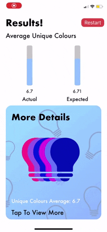

# Lightbulb-Unique-Colours
iOS Application that simulates picking n lightbulbs from a box of i lightbulbs, recording how many unique colours were grabbed and plots that data against the expected value.

## Features

- Easy to use UI
- Error checking on inputs
- Graphs and visuals representing simulated data
- Expected value
- A restart button

## Future Improvements

- Loading screen
- Greater range of input support
- More statistics integration

## UI Display

## Screenshots

